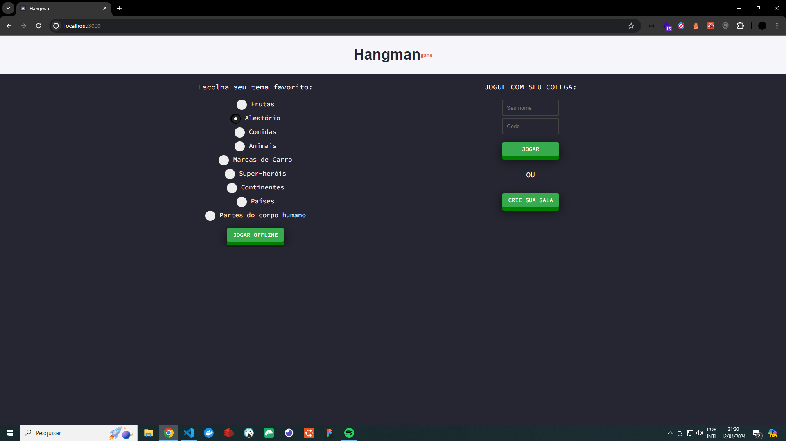
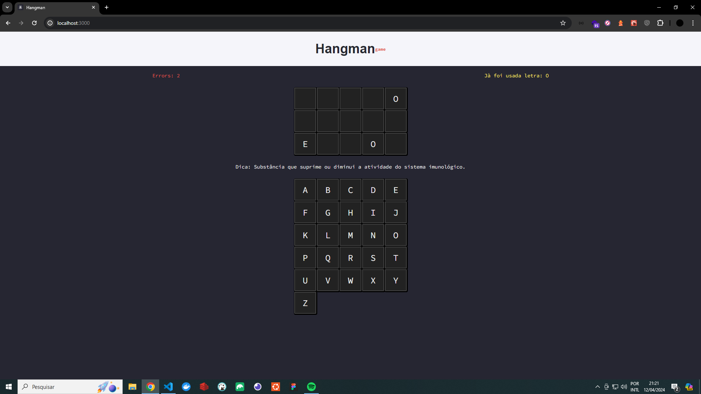
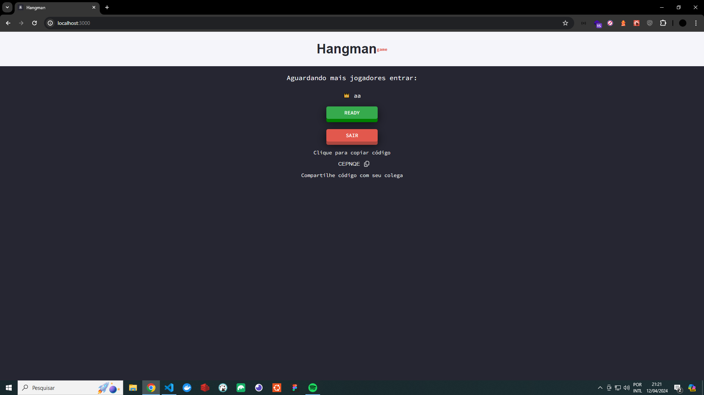
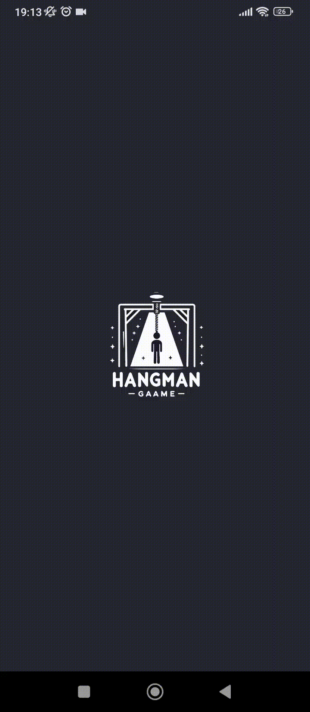

  

## Learn More

Desafie seus amigos ou jogue com pessoas aleatórias no jogo da forca, online ou offline. Com uma variedade de temas e palavras, a diversão é garantida para todos!

## 🚀 Techs
- Lerna (Monorepo)
- Nextjs and Reactjs
- Firebase (Realtime Database)
- PWA
- Styled Components
- Jest
- - Unit
- - Integration
- - Snapshot
- - Coverage report
- - Tests used: mock, faker

## 🖼️ Preview WEB

## 🖼️ Preview MOBILE

## 🐛 Problemas e Suporte

Caso encontre algum problema, sinta-se à vontade para abrir uma [issue](https://github.com/t-heu/hangman/issues).

## 📄 Licença

Este projeto está sob a licença MIT. Veja o arquivo [LICENSE](LICENSE) para mais detalhes.
